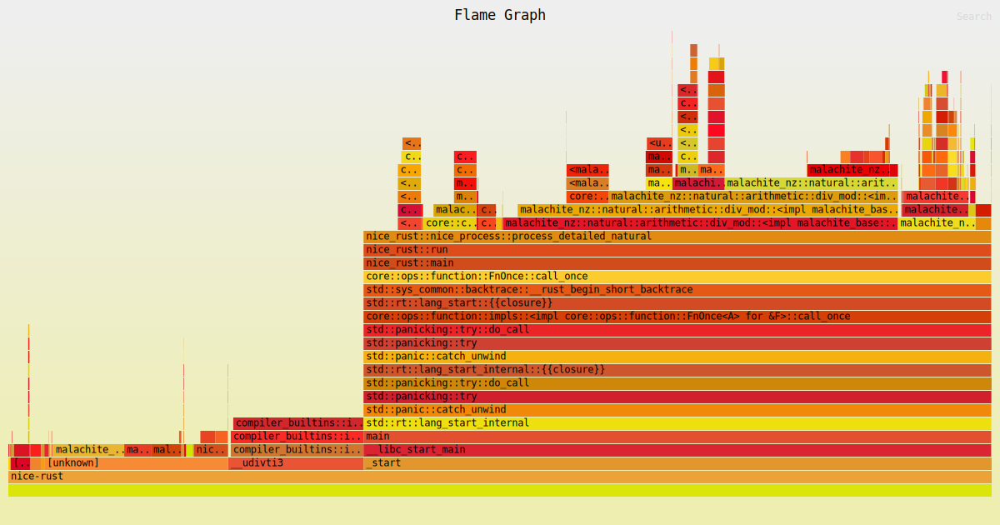

# nice-rust

> a client for distributed search of square-cube pandigitals, now with 100% more crab

## Quickstart

Grab the latest release from the [releases page](https://github.com/wasabipesto/nice-rust/releases/latest) and include your username with the `--username` option. Optionally, use the flag `--benchmark` for a prebuilt offline benchmarking test. This version should run on most linux builds, please open an issue if you have a problem running it.

## Why does this exist

Square-cube pandigials ("nice" numbers) seem to be distributed pseudo-randomly. It doesn't take very long to check if a number is pandigital in a specific base, but even after we narrow the search range to numbers with the right amount of digits in their square and cube there's a lot of numbers to check. This client connects to a central server to avoid duplicating work.

For more background, check out the [original article](https://beautifulthorns.wixsite.com/home/post/is-69-unique) and [my findings](https://wasabipesto.com/nice).

## What this does

This script connects to my server running the [nice-backend](https://github.com/wasabipesto/nice-backend) at `https://nice.wasabipesto.com`. 

When you GET the `/claim` endpoint, the backend returns details of a range to search from the database. Each range is a set of numbers, represented in base 10, alongisde a base to use for representations. The entire possible set of numbers valid in the selected base is divided up into fields of a maximum of 1e9 numbers. This range takes my computer anywhere from 2-7 hours to process, so once you request a range the claim is valid for twelve hours (after which the backend may give this claim to someone else).

When you request a claim, you can optionally include a username in the format `/claim?username=asfaloth`. An example claim response looks like this:

```
{
  "base": 35,
  "claimed_by": "asfaloth",
  "claimed_time": "Wed, 04 Jan 2023 11:43:01 GMT",
  "expiration_time": "Wed, 04 Jan 2023 13:43:01 GMT",
  "search_end": 37069211990,
  "search_id": 120,
  "search_start": 36769211991
}
```

To submit your results, send a POST to `/submit` with the following structure:

```
{
    "search_id": 120, 
    "username": "asfaloth", 
    "client_version": '1.0.0', 
    "unique_count": {
        "1": 0,
        "2": 1,
        ...
    }, 
    "near_misses": {
        "30447607382": 33,
        ...
    }
}
```

- `search_id` should match the ID provided to you in the claim response
- `username` and `client-version` are optional strings for reference only
- `unique_count` is a dict, where
    - the keys are the number of possible unique digits from 1 to the base, and
    - the values are the count of numbers in the range that have that quantity of unique digits
        - the sum of values in this dict should equal the search range
- `near_misses` is a dict, where
    - the keys are numbers who have a niceness >= 0.9 (i.e. the number of unique digits in the representation is greater than/equal to 90% of the max), and
    - the values are the number of unique digits in the representation
        - this dict can be empty if there are no numbers with niceness >= 0

## What you can do

First and foremost, you can run a search node! It doesn't have to be running 24/7, you can shut it down without warning, you are under no obligation to do this for any length of time. Even searching a single range helps!

If you're interested, you can download this souce code and make some tweaks. See if you can reduce the search time, run a node for a while, and see how you stack up. Implement it in another language if you'd like!

## Building

If you don't already have rust installed, install it and some dependencies:

```shell
sudo apt install build-essential libssl-dev
curl --proto '=https' --tlsv1.3 https://sh.rustup.rs -sSf | sh
```

Optionally, install some benchmarking tools and enable their use:

```shell
sudo apt install linux-perf
sudo sysctl -w kernel.perf_event_paranoid=1
cargo install flamegraph
```

Download this source code and build it:

```shell
git clone git@github.com:wasabipesto/nice-rust.git
cd nice-rust
cargo build --release
```

If you only plan on running it on the machine you're building it on, you can optimize it for your own CPU:

```shell
RUSTFLAGS="-C target-cpu=native" cargo build --release
```

The output will be at `target/release/nice-rust`.

Generate a flamegraph:

```shell
cargo flamegraph -- --benchmark
```

## Performance

The main places for optimization seem to be:

- Sorting the digits in the square-cube list, which is required for deduplication in getting the number of unique values. I tried using a HashSet instead, but inserting everything in the set took even longer. A good implementation could cut this down though.
    - Update: Using a boolean array removed this bottleneck and opened the possibility of stopping after the square for quick searches.
- Taking the input number to the second/third power, which is obviously required and probably cannot be optimized without a massive lookup table. And we never have to do it more than once for any number, so we can't cache results.
    - Update: Zentrik brought good contributions to this one too, like multiplying the square by the number instead of cubing from scratch.
- Converting numbers to the desired base, which is again necessary and also abstracted away by ~~`num-bigint`~~ now `malachite`. I don't think I can make this any faster.
    - Update: Malachite is better on a lot of axes but we might be able to roll our own conversion and save by preallocating some memory.

